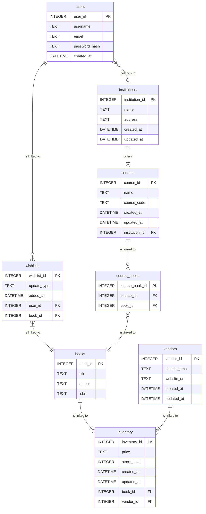

# Textbook Website

A website connecting students with textbook suppliers

## Features

- **User Management**: Login and regiistration system for users
- **Wishlist Management**: Add, view, and update wishlist information
- **Vendor Management**: Login and registration system for vendors
- **Textbook Management**: Organize textbooks by universisties and suppliers
- **Price Comparisons**: Comparing textbook prices from different suppliers
- **Easy Purchasing Access**: Click on prices to go directly to the supplier of the textbook (only on Calculus tetxbook currently)

## Database Setup

### Using SQLite Command Line

1. Open command prompt/terminal in the project directory
2. Run the SQL commands:
   ```bash
   sqlite3 data.db < data.sql
   ```

## Database Schema

### Entity Relationship Diagram (ERD)



The database includes the following tables:

### Tables

1. **users**: Registered user data such as contact details and login information.
2. **books**: Textbook data with authors and isbn.
3. **courses**: Course data with name and course code.
4. **course_books**: Data for the book used for a specific course.
5. **wishlists**: Textbooks that users have identified as a want.
6. **insitutions**: Institution data with address.
7. **vendors**: Supplier data with contact details and website url.
8. **inventory**: Keeps inventory of a specific book.

### Views

1. **wishlist**: Create groups of textbooks you want to buy.
2. **textbook_price_comparison**: See prices from different suppliers for new, used and e-textbooks.

## Sample Data

The database includes sample data for testing:

- **5 users**: Tonya, Tiana, Leandri, Kaylin, Ibrahim
- **8 textbooks**: Basic Accounting for Non-Accountants (4th Edition), Calculus: Early Transcendentals (9th Edition), Chemistry and Chemical Reactivity (10th Edition), Differential Equations with Boundary Value Problems (9th Edition), 
Physics for Scientists and Engineers (10th Edition), Engineering Mechanics: Dynamics (8th Edition), Mechanical Engineering Design (11th Edition), Supply Chain Management: A Logistics Perspective (12th Edition)
- **5 institutions**: Stellenbosch University, University of Pretoria, University of Cape Town, University of Witswaterstrand, University of Johannesburg
- **2 wishlist transactions**: Sample wishlist transaction history

## File Structure

```
├── index.html              # Home page
├── login.html              # User login page
├── register.html           # User registration page
├── newBooks.html           # View all textbooks
├── Textbook_pages folder   # folder with all textbook pages
    ├── accounting-textbook.html   
    ├── calculus-textbook.html    
    ├── chemistry-textbook.html   
    ├── differential-equations-textbook.html   
    ├── dynamics-textbook.html 
    ├── mechanical-design-textbook.html    
    ├── physics-textbook.html   
    ├── supply-chain-textbook.html                 
├── University_Pages folder    # folder with all University pages
    ├── stellies.html  
    ├── uct.html 
    ├── uj.html 
    ├── up.html 
    ├── wits.html 
├── wishlist.html           # Update wishlists
├── data.sql           # Database schema and sample data
├── data.db            # SQLite database (created after running setup)
└── readme.md              # This file
```

## Usage - Textbooks

1. Initialize the database using the SQLite command line method above
2. Open `index.html` in your web browser
3. Navigate to the textbook tab
4. Select the textbook you are looking for
5. Click on the new books, used books and e-books tabs to compare prices
6. Click on the prices to be taken to the textbook supplier page (currently only on Calculus textbook)
7. Add textbooks to the wishlist
8. Navigate to the wishlist page to view textbooks and remove them

## Usage - Universities
1. Initialize the database using the SQLite command line method above
2. Open `index.html` in your web browser
3. Navigate to the university tab
4. Select your university
5. Select your faculty, degree, level of studies and year of studies

## Technologies Used

- **HTML5**: Structure and forms
- **Bootstrap 5.3.8**: UI framework and styling
- **Bootstrap Icons**: Icon set
- **SQLite**: Database for data persistence
- **CSS**: Styling

## Browser Compatibility

The application works with all modern browsers that support HTML5 and CSS3, including:
- Chrome 90+
- Firefox 88+
- Safari 14+
- Edge 90+

Note: This is a static HTML application. For production use, you would need to add backend functionality for database connectivity and form processing.
